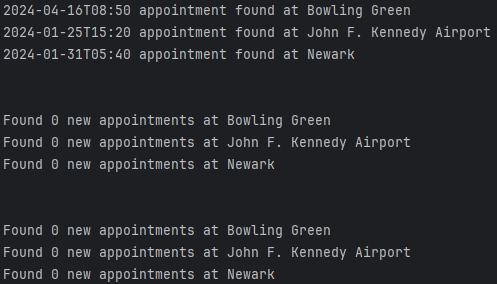

# Global Entry Appointment Scanner

## Overview
This script is designed to help users find earlier appointments for Global Entry by scanning for openings at designated
appointment centers. It notifies users of available appointments through the terminal and optionally via text message.
This tool is intended for finding appointments much sooner than the typical 3+ months waiting period. I (Tom Parker)
easily found one a few days later after running the script for less than a day.

## Prerequisites
Before you begin, ensure you have the following:
- A Twilio account for sending text messages (optional).
- Python 3 installed on your machine. The script uses 3.9, so if you have a different version, and it does not work, it
  is possible that that is why. 
- Git (for cloning the repository).

## Installation

### Clone the Repository
First, clone the repository to your local machine:
```bash
git clone https://github.com/parkertomf/global-entry-appointment-scanner.git
cd global-entry-appointment-scanner
```

### Setting Up the Development Environment

It is recommended to use a virtual environment to manage dependencies for this project. If you are using an IDE like PyCharm, it should do so automatically. You'll know if it exists because there will be a `.venv` directory at the project root.

1. **Create a Virtual Environment** (if you don't have one already):
   Run the following command in the root directory of the project:
   ```
   python -m venv .venv
   ```

2. **Activate the Virtual Environment**:
   - On Windows not using Git Bash or another Unix-like environment,run:
     ```
     .venv\Scripts\activate
     ```
   - On Unix, MacOS, or Windows using Git Bash or another Unix-like environment, run:
     ```
     source .venv/bin/activate
     ```

3. **Install Required Packages**:

    If you don't have pip, the standard package manager for Python, you can either install it or install the requirements in another way.
    
    To check if you do have pip, run the following in the terminal:
    ```
    python -m pip --version
    ```
    
    To install pip, follow the instructions in the pip documentation: https://pip.pypa.io/en/stable/installation/
    
    If / once you do have pip, then install the requirements.
    
    Run the following commands.
    ```
    pip install python-dateutil
    pip install python-dotenv
    ```
    
    You may also be able to install the final required package (Twilio) this way, but I installed it via my IDE (PyCharm).
    Regardless, there are installation instructions here, including one method using pip: https://pypi.org/project/twilio/

### (Optional) Set up a Twilio Account
If you want text notifications to a phone number, you must make a Twilio account. Contrary to seemingly popular belief,
one can be made for free.

Note that it does take a day or two for your account to be validated to the point that it will allow you to send text
messages.

Setting up an account is not very painful, but it _is_ an extra step, so if you are happy just watching your terminal,
it does work. I got an appointment before my Twilio account was validated to the point of effectiveness just by watching
the terminal.

### Set Up Environment Variables

Note that although all these environment variables have to do with Twilio, unless you alter the code, you will still
need to set this up for the script to run. If you don't care about text messaging notifications, you can just keep the
placeholder values.

1. Create a `.env` file in the root directory of the project.
2. Add the following lines to the `.env` file, replacing placeholders with your actual data:
   ```
   ACCOUNT_SID='your_twilio_account_sid'
   AUTH_TOKEN='your_twilio_auth_token'
   TWILIO_PHONE_NUMBER='twilio_phone_number'
   YOUR_PHONE_NUMBER='your_phone_number'
   ```
3. Replace `your_twilio_account_sid` and `your_twilio_auth_token` with your Twilio credentials.
4. Replace `your_phone_number` with the phone number where you wish to receive notifications (format: +1234567890).

## Usage

### Configuration
Configure the script by editing the `location_map` in `main.py` to include the Global Entry locations you are interested in. You can find location IDs by inspecting network traffic on the Global Entry scheduling page.

### Running the Script
Run the script with:
```
python main.py
```

The script will continuously check for available appointments and notify you of any new openings at your specified locations.

## Example Notifications

Below is an example of three iterations of output in your terminal:



Below is an example of a several text notifications received when an appointment in your specified time range becomes available:


## Contributing
Feel free to fork this repository and submit pull requests for any enhancements or fixes. Also feel free to open an
issue to let me know of any problems.
