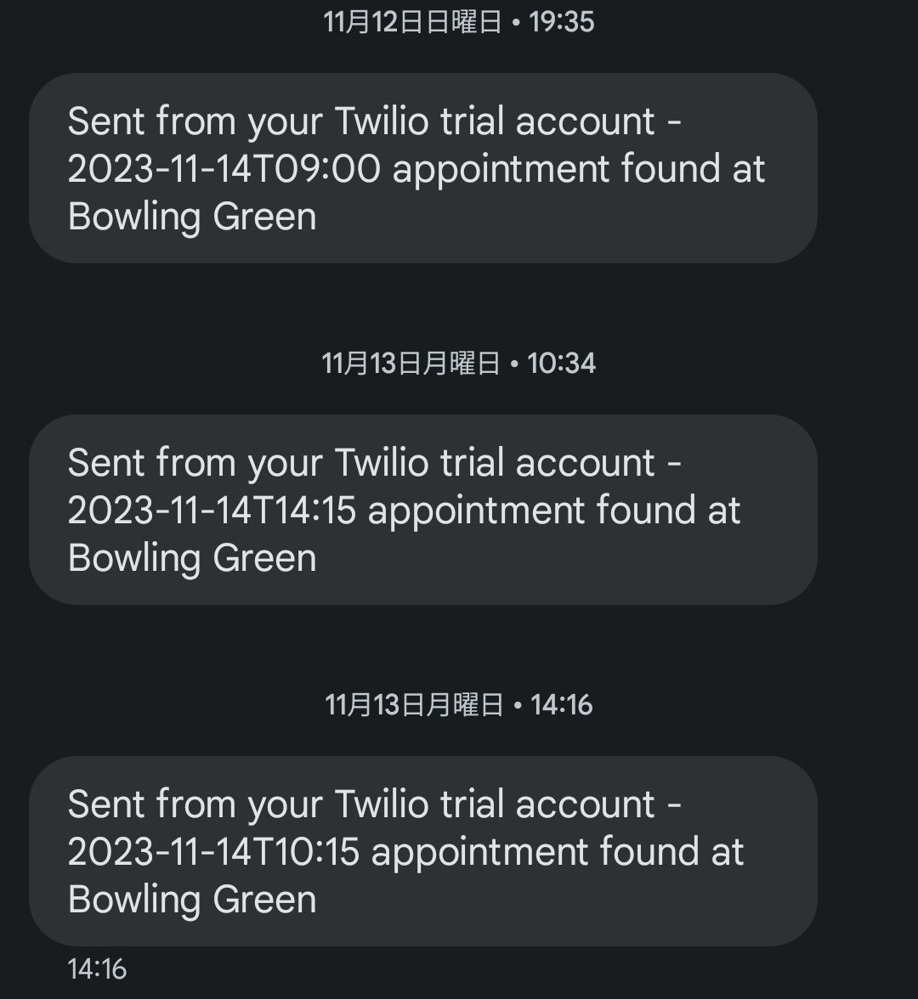

# Global Entry Appointment Scanner

## Overview
This script is designed to help users find earlier appointments for Global Entry by scanning for openings or cancellations at designated appointment centers. It notifies users of available appointments through the terminal and optionally via text message. This tool is especially useful for finding appointments that may be available much sooner than the typical 3+ months waiting period.

## Prerequisites
Before you begin, ensure you have the following:
- A Twilio account for sending text messages (optional).
- Python 3 installed on your machine.
- Git (for cloning the repository).

## Installation

### Clone the Repository
First, clone the repository to your local machine:
```bash
git clone https://github.com/parkertomf/global-entry-appointment-scanner.git
cd global-entry-appointment-scanner
```

### Install Required Packages
Install the required Python packages:
```bash
pip install -r requirements.txt
```

### Set Up Environment Variables
1. Create a `.env` file in the root directory of the project.
2. Add the following lines to the `.env` file, replacing placeholders with your actual data:
   ```
   ACCOUNT_SID='your_twilio_account_sid'
   AUTH_TOKEN='your_twilio_auth_token'
   TWILIO_PHONE_NUMBER='twilio_phone_number'
   YOUR_PHONE_NUMBER='your_phone_number'
   ```
3. Replace `your_twilio_account_sid` and `your_twilio_auth_token` with your Twilio credentials.
4. Replace `your_phone_number` with the phone number where you wish to receive notifications (format: +1234567890).

## Usage

### Configuration
Configure the script by editing the `location_map` in `main.py` to include the Global Entry locations you are interested in. You can find location IDs by inspecting network traffic on the Global Entry scheduling page.

### Running the Script
Run the script with:
```bash
python main.py
```

The script will continuously check for available appointments and notify you of any new openings at your specified locations.

## Example Notifications

Below is an example of three iterations of output in your terminal:


Below is an example of a several text notifications received when an appointment in your specified time range becomes available:



## Contributing
Feel free to fork this repository and submit pull requests for any enhancements or fixes.
